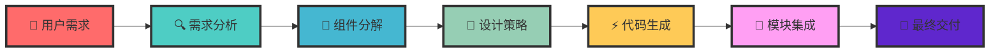

# 🚀 GarenCode Design - AI驱动的智能组件设计平台

<div align="center">


<br>
<em>⚔️ 以盖伦之名，铸就完美设计 ⚔️</em>

[](https://github.com/lyw405/mcp-garendesign)
[](https://github.com/lyw405/mcp-garendesign)
[](LICENSE)
[](https://github.com/lyw405/mcp-garendesign)

**🎯 从需求到代码，AI驱动的智能设计流水线**  
**⚡ 让每个开发者都能成为组件设计大师**

</div>

---

## 📋 目录导航

- [🌟 项目介绍](#-项目介绍)
- [🎨 设计流程](#-设计流程)
- [⚙️ 项目配置](#️-项目配置)
- [🔧 IDE 集成](#-ide-集成)
- [🚀 快速开始](#-快速开始)
- [📚 使用指南](#-使用指南)
- [🔮 未来计划](#-未来计划)
- [🏗️ 项目架构](#️-项目架构)

---

## 🌟 项目介绍

### 🎯 核心理念

**GarenCode Design** 是一个基于 MCP (Model Context Protocol) 的 AI 驱动组件设计平台。我们致力于让每个开发者都能轻松创建高质量的前端组件，从需求分析到代码生成，全程智能化。

### ✨ 核心特性

<table>
<tr>
<td align="center" width="200">
<strong>🎨 智能设计</strong><br>
AI驱动的组件设计<br>
自动分析用户需求<br>
智能推荐最佳实践
</td>
<td align="center" width="200">
<strong>⚡ 高效生成</strong><br>
多AI模型支持<br>
实时代码生成<br>
类型安全保证
</td>
<td align="center" width="200">
<strong>🔧 私有组件</strong><br>
企业级组件库<br>
统一设计规范<br>
可复用组件生态
</td>
</tr>
</table>

### 🏆 技术优势

- **🚀 开发效率提升 50%+** - 从需求到代码的自动化流水线
- **🎯 设计一致性** - 统一的组件库和设计规范
- **🔧 高度可维护** - 标准化的代码结构和API设计
- **⚡ 多模型支持** - Claude、GPT、DeepSeek、Ollama 等主流AI模型

---

## 🎨 设计流程

### 🔄 核心工作流



### 📝 详细流程说明

#### 1️⃣ **需求分析阶段** 🔍

```typescript
// AI 智能分析用户需求
const analysis = await analyzeRequirement({
  userInput: '创建一个用户管理页面',
  context: '企业级后台管理系统',
  constraints: ['Vue 3', 'TypeScript', '私有组件库'],
});
```

#### 2️⃣ **复杂度评估** 📊

```typescript
// 自动评估组件复杂度
const complexity = await assessComplexity({
  requirements: analysis.requirements,
  businessLogic: analysis.businessLogic,
  uiComplexity: analysis.uiComplexity,
});
// 输出: { level: "complex", estimatedBlocks: 5, estimatedTokens: 8000 }
```

#### 3️⃣ **智能分解** 🧩

```typescript
// 将复杂需求分解为可管理的设计块
const blocks = await decomposeToBlocks({
  requirements: analysis.requirements,
  complexity: complexity,
  designStrategy: 'block-based',
});
// 输出: [
//   { id: "user-list", type: "data-display", priority: "high" },
//   { id: "user-form", type: "form", priority: "medium" },
//   { id: "user-detail", type: "detail-view", priority: "low" }
// ]
```

#### 4️⃣ **设计策略生成** 🎨

```typescript
// 生成详细的设计策略
const strategy = await generateDesignStrategy({
  blocks: blocks,
  componentLibrary: 'private-components',
  designSystem: 'garen-design-system',
});
```

#### 5️⃣ **分块开发** ⚡

```typescript
// 逐个设计块进行开发
for (const block of blocks) {
  const design = await designBlock({
    block: block,
    strategy: strategy,
    aiModel: getRecommendedModel('DESIGN'),
  });

  const code = await generateCode({
    design: design,
    framework: 'vue3',
    typescript: true,
  });
}
```

#### 6️⃣ **智能集成** 🔗

```typescript
// 将所有设计块集成到完整页面
const integration = await integrateDesign({
  blocks: completedBlocks,
  layout: 'responsive',
  dataFlow: 'centralized',
});
```

---

## ⚙️ 项目配置

### 📁 配置文件结构

```
data/
├── config.json              # 🎯 AI模型配置（实际使用）
├── config.example.json      # 📝 AI配置示例（去除敏感信息）
├── codegens.json            # 🧩 私有组件库配置（实际使用）
└── codegens.example.json    # 📚 组件库配置示例
```

### 🔑 AI模型配置

#### 1. 复制配置文件

```bash
# 复制示例配置文件
cp data/config.example.json data/config.json
cp data/codegens.example.json data/codegens.json
```

#### 2. 配置AI提供商

编辑 `data/config.json`：

```json
{
  "defaultModels": {
    "ANALYSIS": "claude-3-7-sonnet-latest",
    "DESIGN": "claude-3-5-sonnet-latest",
    "QUERY": "claude-3-5-sonnet-latest",
    "INTEGRATION": "claude-3-7-sonnet-latest"
  },
  "providers": [
    {
      "provider": "anthropic",
      "models": [
        {
          "model": "claude-3-5-sonnet-latest",
          "title": "Claude 3.5 Sonnet",
          "baseURL": "https://api.302.ai/v1",
          "features": ["reasoning", "creativity"],
          "apiKey": "sk-your-anthropic-api-key-here"
        }
      ]
    },
    {
      "provider": "openai",
      "models": [
        {
          "model": "gpt-4o",
          "title": "GPT-4o",
          "baseURL": "https://api.openai.com/v1",
          "features": ["vision", "reasoning", "creativity"],
          "apiKey": "sk-your-openai-api-key-here"
        }
      ]
    }
  ]
}
```

#### 3. 支持的AI提供商

<table>
<tr>
<th>提供商</th>
<th>特性</th>
<th>配置示例</th>
</tr>
<tr>
<td>🤖 <strong>Anthropic</strong></td>
<td>推理、创意</td>
<td><code>https://api.anthropic.com</code></td>
</tr>
<tr>
<td>🧠 <strong>OpenAI</strong></td>
<td>视觉、推理</td>
<td><code>https://api.openai.com/v1</code></td>
</tr>
<tr>
<td>🔍 <strong>DeepSeek</strong></td>
<td>推理、创意</td>
<td><code>https://api.deepseek.com</code></td>
</tr>
<tr>
<td>🏠 <strong>Ollama</strong></td>
<td>本地部署</td>
<td><code>http://localhost:11434</code></td>
</tr>
</table>

#### 4. 验证配置

```bash
# 验证AI配置
node scripts/validate-config.js

# 测试模型连接
node scripts/test-model-recommendation.js
```

### 🧩 私有组件库配置

`data/codegens.json` 包含了完整的私有组件库配置：

```json
[
  {
    "title": "Private Component Codegen",
    "description": "基于私有组件的代码生成器",
    "fullStack": "Vue",
    "rules": [
      {
        "type": "private-components",
        "description": "私有组件使用规则",
        "docs": {
          "组件名称": {
            "purpose": "使用目的",
            "usage": "项目中经常使用的场景描述",
            "props": {
              // props 参数相关
              "type": "",
              "size": ""
              ...
            }
          }
        }
      }
    ]
  }
]
```

---

## 🔧 IDE 集成

### 📝 MCP 配置文件

创建 `mcp-config.json` 文件：

```json
{
  "mcpServers": {
    "garencode-design": {
      "command": "/bin/zsh",
      "args": ["-c", "cd /path/to/your/project && npm run mcp:dev"]
    }
  }
}
```

### 🎯 使用方式

#### 1. 在 Cursor 中使用

```typescript
// 在 Cursor 中调用 MCP 工具
const result = await mcp.callTool({
  name: 'design_component',
  arguments: {
    prompt: [
      {
        type: 'text',
        text: '创建一个用户管理页面，包含用户列表、搜索、新增/编辑功能',
      },
    ],
  },
});
```

#### 2. 在 VS Code 中使用

```json
// settings.json
{
  "mcp.servers": {
    "garencode-design": {
      "command": "node",
      "args": ["dist/mcp-server.js"],
      "cwd": "/path/to/garencode-design"
    }
  }
}
```

---

## 🚀 快速开始

### 1️⃣ 环境准备

```bash
# 克隆项目
git clone https://github.com/lyw405/mcp-garendesign.git
cd mcp-garendesign

# 安装依赖
npm install
# 或使用 pnpm
pnpm install
```

### 2️⃣ 配置设置

```bash
# 复制配置文件
cp data/config.example.json data/config.json
cp data/codegens.example.json data/codegens.json

# 编辑配置文件，填入您的API密钥
vim data/config.json
```

### 3️⃣ 启动服务

```bash
# 使用启动脚本
chmod +x scripts/start-standalone.sh
./scripts/start-standalone.sh

# 或手动启动
npm run build
npm run mcp:dev
```

### 4️⃣ 验证安装

```bash
# 验证配置
node scripts/validate-config.js

# 测试模型推荐
node scripts/test-model-recommendation.js
```

---

## 📚 使用指南

### 🎨 组件设计工具

#### design_component

设计前端组件：

```json
{
  "name": "design_component",
  "arguments": {
    "prompt": [
      {
        "type": "text",
        "text": "创建一个产品卡片组件，包含图片、标题、价格和购买按钮"
      }
    ]
  }
}
```

#### design_block

设计复杂页面的单个块：

```json
{
  "name": "design_block",
  "arguments": {
    "prompt": [
      {
        "type": "text",
        "text": "设计用户列表管理块，包含表格、搜索、分页功能"
      }
    ]
  }
}
```

#### query_component

查询组件详细信息：

```json
{
  "name": "query_component",
  "arguments": {
    "componentName": "das-button"
  }
}
```

### 🔄 完整工作流示例

```typescript
import { MCPClient } from '@modelcontextprotocol/sdk/client';

const client = new MCPClient({
  name: 'GarenCode Design Client',
  version: '1.0.0',
});

// 连接服务
await client.connect({
  type: 'stdio',
  command: 'tsx',
  args: ['src/mcp-server.ts'],
});

// 设计组件
const result = await client.callTool({
  name: 'design_component',
  arguments: {
    prompt: [
      {
        type: 'text',
        text: '创建一个登录表单组件，包含用户名、密码输入框和登录按钮',
      },
    ],
  },
});

console.log('🎉 组件设计完成:', result);
```

---

## 🔮 未来计划

### 🎯 当前能力

✅ **私有组件复用** - 完整的私有组件库支持  
✅ **智能设计流程** - AI驱动的组件设计  
✅ **多模型支持** - Claude、GPT、DeepSeek、Ollama  
✅ **类型安全** - 完整的 TypeScript 支持  
✅ **配置管理** - 灵活的AI模型配置

### 🚀 即将推出

#### 1️⃣ **私有状态管理** 🔄

```typescript
// 未来功能：自动状态管理
const stateConfig = {
  globalState: {
    user: 'UserState',
    theme: 'ThemeState',
    language: 'LanguageState',
  },
  localState: {
    form: 'FormState',
    modal: 'ModalState',
  },
};

// AI 自动生成状态管理代码
const stateCode = await generateStateManagement({
  components: designedComponents,
  stateConfig: stateConfig,
  framework: 'pinia', // 或 vuex, zustand
});
```

#### 2️⃣ **全局属性自动化** ⚙️

```typescript
// 未来功能：全局属性自动注入
const globalProps = {
  theme: 'light | dark',
  language: 'zh-CN | en-US',
  permissions: 'admin | user | guest',
  device: 'desktop | mobile | tablet',
};

// AI 自动为组件注入全局属性
const enhancedComponents = await injectGlobalProps({
  components: designedComponents,
  globalProps: globalProps,
  injectionStrategy: 'automatic',
});
```

#### 3️⃣ **智能代码优化** 🧠

```typescript
// 未来功能：代码性能优化
const optimization = await optimizeCode({
  components: generatedComponents,
  optimizationTargets: [
    'bundle-size',
    'runtime-performance',
    'memory-usage',
    'accessibility',
  ],
});
```

#### 4️⃣ **设计系统集成** 🎨

```typescript
// 未来功能：设计系统自动同步
const designSystem = await syncDesignSystem({
  components: designedComponents,
  designTokens: {
    colors: 'design-tokens/colors.json',
    typography: 'design-tokens/typography.json',
    spacing: 'design-tokens/spacing.json',
  },
  syncStrategy: 'real-time',
});
```

### 📅 开发路线图

<table>
<tr>
<th>阶段</th>
<th>功能</th>
<th>状态</th>
</tr>
<tr>
<td>🎯 <strong>Phase 1</strong></td>
<td>私有组件复用</td>
<td>🟢 生产就绪</td>
</tr>
<tr>
<td>🔄 <strong>Phase 2</strong></td>
<td>私有状态管理</td>
<td>🟡 开发中</td>
</tr>
<tr>
<td>⚙️ <strong>Phase 3</strong></td>
<td>全局属性自动化</td>
<td>🟠 规划中</td>
</tr>
<tr>
<td>🧠 <strong>Phase 4</strong></td>
<td>智能代码优化</td>
<td>🔴 计划中</td>
</tr>
</table>

---

## 🏗️ 项目架构

### 📁 目录结构

```
mcp-garendesign/
├── 📁 src/
│   ├── 🚀 mcp-server.ts          # MCP 服务器入口
│   ├── 🛠️ tools/                 # MCP 工具实现
│   │   ├── design/
│   │   │   ├── component.ts      # 组件设计工具
│   │   │   └── block.ts          # 块设计工具
│   │   └── query/
│   │       └── component.ts      # 组件查询工具
│   ├── 🧠 core/                  # 核心业务逻辑
│   │   ├── design/               # 设计引擎
│   │   │   ├── complexity-analyzer.ts
│   │   │   ├── strategy/
│   │   │   ├── blocks/
│   │   │   └── integration/
│   │   └── query/                # 查询引擎
│   ├── ⚙️ config/                # 配置管理
│   │   ├── ai-client-adapter.ts  # AI 客户端适配器
│   │   ├── model-manager.ts      # 模型管理器
│   │   ├── config-validator.ts   # 配置验证器
│   │   └── types.ts              # 配置类型定义
│   ├── 🎨 utils/                 # 工具函数
│   │   └── formatters/           # 格式化工具
│   ├── 📚 resources/             # MCP 资源
│   └── 🏷️ types/                 # 类型定义
├── 📁 data/                      # 配置文件
│   ├── config.json               # AI 模型配置
│   ├── config.example.json       # 配置示例
│   ├── codegens.json             # 私有组件库配置
│   └── codegens.example.json     # 组件库配置示例
├── 📁 scripts/                   # 脚本文件
├── 📁 docs/                      # 文档
└── 📄 package.json
```

### 🔧 添加新工具

1. **创建工具文件**

```typescript
// src/tools/design/new-tool.ts
export async function newTool(args: NewToolArgs): Promise<ToolResult> {
  // 工具实现逻辑
  return {
    content: [
      {
        type: 'text',
        text: '工具执行结果',
      },
    ],
  };
}
```

2. **注册工具**

```typescript
// src/mcp-server.ts
import { newTool } from './tools/design/new-tool.js';

// 在工具列表中注册
tools: [
  // ... 其他工具
  {
    name: 'new_tool',
    description: '新工具描述',
    inputSchema: {
      type: 'object',
      properties: {
        // 输入参数定义
      },
    },
  },
];
```

### 📚 添加新资源

1. **创建资源函数**

```typescript
// src/resources/index.ts
export function getNewResource() {
  return {
    contents: [
      {
        type: 'text',
        text: '资源内容',
      },
    ],
  };
}
```

2. **注册资源**

```typescript
// src/mcp-server.ts
import { getNewResource } from './resources/index.js';

// 在资源列表中注册
resources: [
  // ... 其他资源
  {
    uri: 'garencode://resources/new-resource',
    name: 'new_resource',
    description: '新资源描述',
    mimeType: 'text/plain',
  },
];
```

### 🧪 测试

```bash
# 运行测试
npm test

# 验证配置
node scripts/validate-config.js

# 测试模型推荐
node scripts/test-model-recommendation.js
```

---

## 🤝 贡献指南

我们欢迎所有形式的贡献！

### 🐛 报告问题

如果您发现了问题，请 [创建 Issue](https://github.com/lyw405/mcp-garendesign/issues)。

### 💡 提交功能请求

如果您有新功能想法，请 [创建 Feature Request](https://github.com/lyw405/mcp-garendesign/issues/new?template=feature_request.md)。

### 🔧 提交代码

1. Fork 项目
2. 创建功能分支 (`git checkout -b feature/amazing-feature`)
3. 提交更改 (`git commit -m 'Add amazing feature'`)
4. 推送到分支 (`git push origin feature/amazing-feature`)
5. 创建 Pull Request

---

## 📄 许可证

本项目采用 [MIT 许可证](LICENSE)。

---

<div align="center">

**⚔️ 以盖伦之名，铸就完美设计 ⚔️**

**🌟 GarenCode Design - 让每个组件都符合心意**

[](https://github.com/lyw405/mcp-garendesign)
[](https://github.com/lyw405/mcp-garendesign)
[](https://github.com/lyw405/mcp-garendesign/issues)

</div>
